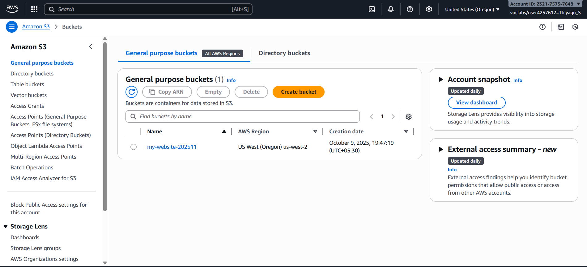
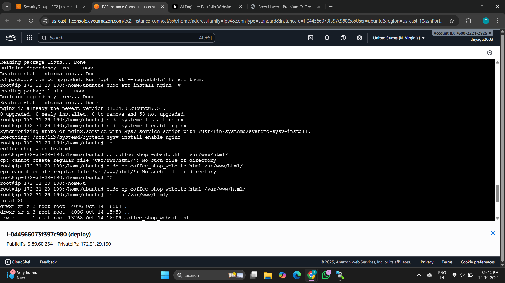
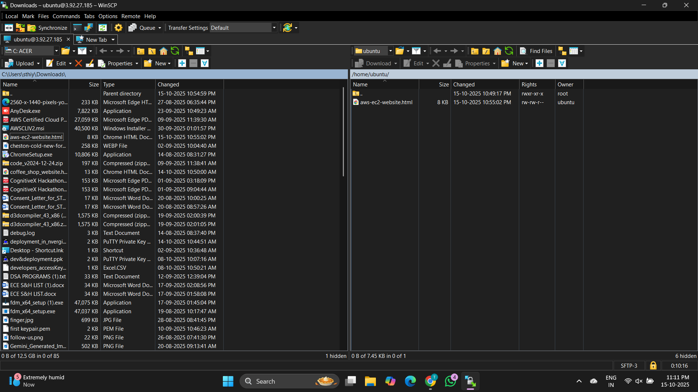
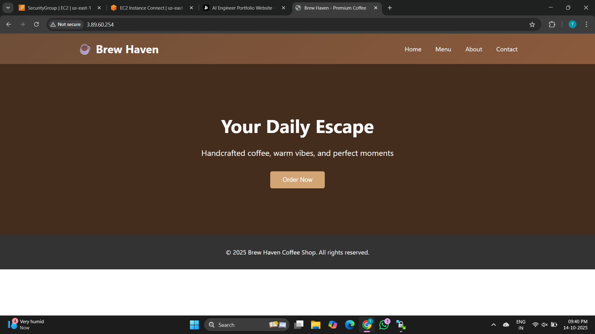
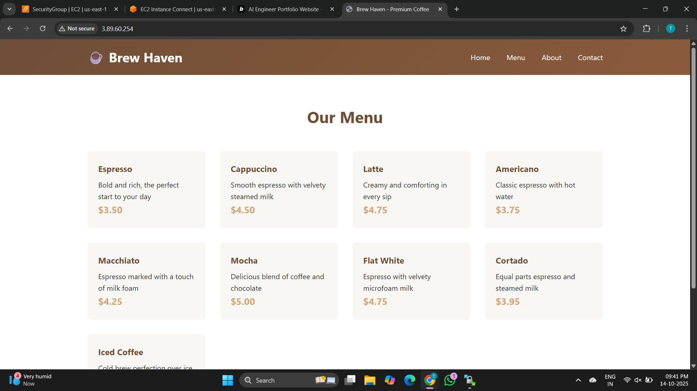

# 🚀 Deploying a Static Website on AWS EC2 using Nginx

This project documents the process of deploying a **simple static website** on an **Amazon EC2 instance** running **Ubuntu** using **Nginx** as the web server.

---

## 🧠 Overview

I successfully hosted a static website on AWS EC2 by configuring an Ubuntu instance, installing and setting up Nginx, and transferring files using **WinSCP**.  
The site is now accessible through the EC2 public IP address.

---

## 🛠️ Technologies Used

- **AWS EC2 (Ubuntu 22.04)**
- **Nginx**
- **WinSCP** (for file transfer)
- **SSH (EC2 Connect / Terminal)**
- **HTML, CSS** (Static website files)

---

## ⚙️ Deployment Steps

### 🖥️ Step 1: Launch an EC2 Instance

1. Open the **AWS Management Console**.
2. Navigate to **EC2** and click **Launch Instance**.
3. Choose **Ubuntu Server (Free Tier eligible)**.
4. Select instance type: `t2.micro`.
5. Create or choose an existing key pair.
6. Configure **Security Group**:
   - Allow **HTTP (Port 80)**
   - Allow **SSH (Port 22)**
   - Allow **HTTPS (Port 443)** (optional)
7. Launch the instance.

**📸 Screenshot:**


---

### 🔗 Step 2: Connect to the EC2 Instance

You can connect using **EC2 Instance Connect** (browser-based SSH)  
or from your terminal:

```bash
ssh -i "your-key.pem" ubuntu@your-ec2-public-ip
````

**📸 Screenshot:**


---

### 🌐 Step 3: Update System and Install Nginx

Run the following commands:

```bash
sudo apt update
sudo apt install nginx -y
```

Check Nginx status:

```bash
sudo systemctl status nginx
```

If inactive, start it:

```bash
sudo systemctl start nginx
```

**📸 Screenshot:**


---

### 📂 Step 4: Transfer Website Files using WinSCP

1. Open **WinSCP** and choose **SFTP** as the file protocol.
2. Enter:

   * Hostname: `<your-ec2-public-ip>`
   * Username: `ubuntu`
   * Private key file: select your `.pem` key.
3. Connect and navigate to:

   ```
   /var/www/html/
   ```
4. Upload your website files (`index.html`, `style.css`, etc.) here.

**📸 Screenshot:**


---

### 🌎 Step 5: Verify Deployment

Open your browser and visit:

```
http://<your-ec2-public-ip>
```

If everything is configured correctly, your website should load successfully.

**📸 Screenshot:**






---

### 🔒 Step 6: (Optional) Configure Firewall

Enable Nginx through the Ubuntu firewall:

```bash
sudo ufw allow 'Nginx HTTP'
sudo ufw enable
```

Check the status:

```bash
sudo ufw status
```

---

## ✅ Summary

* Deployed a **static website** on **AWS EC2 (Ubuntu)**
* Configured **Nginx** web server
* Used **WinSCP** for file transfer
* Verified deployment through EC2 public IP
* Configured **inbound and outbound rules** for HTTP/HTTPS access

---

## 🖼️ Sample Images

*(Add your screenshots in the `images/` folder and reference them in the above placeholders)*

---

## 👤 Author

**Thiyagu S**
Deployed with ❤️ on **AWS Cloud** using **EC2 & Nginx**.

---
